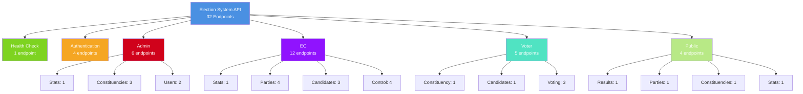

# 📋 Election System - API Endpoints Summary

> **Backend:** Express.js + Prisma + PostgreSQL (Supabase)  
> **Base URL:** `http://localhost:4000`  
> **Authentication:** JWT Bearer Token

---

## 📊 สรุปจำนวน Endpoints

| ประเภท                       | จำนวน  | Authentication | Authorization          |
| ---------------------------- | ------ | -------------- | ---------------------- |
| **Health Check**             | 1      | ❌             | -                      |
| **Authentication**           | 4      | บางส่วน        | -                      |
| **Admin**                    | 6      | ✅             | `admin`                |
| **EC (Election Commission)** | 12     | ✅             | `ec`, `admin`          |
| **Voter**                    | 5      | ✅             | `voter`, `admin`, `ec` |
| **Public**                   | 4      | ❌             | -                      |
| **รวมทั้งหมด**               | **32** | -              | -                      |

---

## 🏥 Health Check (1 endpoint)

### `GET /health`

- **คำอธิบาย:** ตรวจสอบสถานะ server
- **Authentication:** ❌ ไม่ต้อง
- **Response:**
  ```json
  {
    "status": "ok",
    "timestamp": "2026-02-05T10:00:00.000Z"
  }
  ```

---

## 🔐 Authentication (4 endpoints)

### 1. `POST /api/auth/register`

- **คำอธิบาย:** ลงทะเบียนผู้ใช้ใหม่
- **Authentication:** ❌ ไม่ต้อง
- **Request Body:**
  ```json
  {
    "email": "string (email format)",
    "password": "string (min 6 chars)",
    "nationalId": "string (13 digits)",
    "fullName": "string",
    "address": "string",
    "constituencyId": "number (optional)"
  }
  ```
- **Response:** `201 Created`
  ```json
  {
    "success": true,
    "token": "jwt_token",
    "user": { ... }
  }
  ```

### 2. `POST /api/auth/login`

- **คำอธิบาย:** เข้าสู่ระบบ
- **Authentication:** ❌ ไม่ต้อง
- **Request Body:**
  ```json
  {
    "email": "string (email format)",
    "password": "string"
  }
  ```
- **Response:**
  ```json
  {
    "success": true,
    "token": "jwt_token",
    "user": { ... }
  }
  ```

### 3. `GET /api/auth/me`

- **คำอธิบาย:** ดึงข้อมูลผู้ใช้ปัจจุบัน
- **Authentication:** ✅ ต้องมี JWT Token
- **Response:**
  ```json
  {
    "success": true,
    "user": { ... }
  }
  ```

### 4. `POST /api/auth/logout`

- **คำอธิบาย:** ออกจากระบบ (client-side only)
- **Authentication:** ❌ ไม่ต้อง
- **Response:**
  ```json
  {
    "success": true,
    "message": "ออกจากระบบสำเร็จ"
  }
  ```

---

## 👨‍💼 Admin Routes (6 endpoints)

> **Authorization:** ต้องมี role `admin` ทั้งหมด

### Statistics

#### 1. `GET /api/admin/stats`

- **คำอธิบาย:** ดึงสถิติสำหรับ Admin Dashboard
- **Response:**
  ```json
  {
    "success": true,
    "totalUsers": 0,
    "totalConstituencies": 0,
    "totalVotes": 0,
    ...
  }
  ```

### Constituencies Management

#### 2. `GET /api/admin/constituencies`

- **คำอธิบาย:** ดึงรายการเขตเลือกตั้ง (มี pagination + filter)
- **Query Parameters:**
  - `page` (default: 1)
  - `limit` (default: 50)
  - `province` (optional)
- **Response:**
  ```json
  {
    "success": true,
    "data": [...],
    "total": 0,
    "page": 1,
    "totalPages": 1
  }
  ```

#### 3. `POST /api/admin/constituencies`

- **คำอธิบาย:** สร้างเขตเลือกตั้งใหม่
- **Request Body:**
  ```json
  {
    "province": "string",
    "zoneNumber": "number (min 1)"
  }
  ```
- **Response:** `201 Created`

#### 4. `DELETE /api/admin/constituencies/:id`

- **คำอธิบาย:** ลบเขตเลือกตั้ง
- **Response:**
  ```json
  {
    "success": true,
    "message": "ลบเขตเลือกตั้งสำเร็จ"
  }
  ```

### Users Management

#### 5. `GET /api/admin/users`

- **คำอธิบาย:** ดึงรายการผู้ใช้ (มี pagination + filter)
- **Query Parameters:**
  - `page` (default: 1)
  - `limit` (default: 20)
  - `role` (optional: `admin`, `ec`, `voter`)
- **Response:**
  ```json
  {
    "success": true,
    "data": [...],
    "total": 0,
    "page": 1,
    "totalPages": 1
  }
  ```

#### 6. `PATCH /api/admin/users/:id/role`

- **คำอธิบาย:** เปลี่ยน role ของผู้ใช้
- **Request Body:**
  ```json
  {
    "role": "admin | ec | voter"
  }
  ```
- **Response:**
  ```json
  {
    "success": true,
    "data": { ... }
  }
  ```

---

## 🗳️ EC (Election Commission) Routes (12 endpoints)

> **Authorization:** ต้องมี role `ec` หรือ `admin`

### Statistics

#### 1. `GET /api/ec/stats`

- **คำอธิบาย:** ดึงสถิติสำหรับ EC Dashboard
- **Response:**
  ```json
  {
    "success": true,
    "totalParties": 0,
    "totalCandidates": 0,
    ...
  }
  ```

### Parties Management

#### 2. `GET /api/ec/parties`

- **คำอธิบาย:** ดึงรายการพรรคการเมือง
- **Query Parameters:**
  - `page` (default: 1)
  - `limit` (default: 20)

#### 3. `POST /api/ec/parties`

- **คำอธิบาย:** สร้างพรรคการเมืองใหม่
- **Request Body:**
  ```json
  {
    "name": "string",
    "logoUrl": "string (optional)",
    "policy": "string (optional)",
    "color": "string (optional)"
  }
  ```
- **Response:** `201 Created`

#### 4. `PUT /api/ec/parties/:id`

- **คำอธิบาย:** แก้ไขข้อมูลพรรคการเมือง
- **Request Body:** เหมือน POST

#### 5. `DELETE /api/ec/parties/:id`

- **คำอธิบาย:** ลบพรรคการเมือง
- **Response:**
  ```json
  {
    "success": true,
    "message": "ลบพรรคการเมืองสำเร็จ"
  }
  ```

### Candidates Management

#### 6. `GET /api/ec/candidates`

- **คำอธิบาย:** ดึงรายการผู้สมัคร (มี filter)
- **Query Parameters:**
  - `page` (default: 1)
  - `limit` (default: 20)
  - `constituencyId` (optional)
  - `partyId` (optional)

#### 7. `POST /api/ec/candidates`

- **คำอธิบาย:** สร้างผู้สมัครใหม่
- **Request Body:**
  ```json
  {
    "firstName": "string",
    "lastName": "string",
    "candidateNumber": "number (min 1)",
    "imageUrl": "string (optional)",
    "personalPolicy": "string (optional)",
    "nationalId": "string (13 digits)",
    "partyId": "number",
    "constituencyId": "number"
  }
  ```
- **Response:** `201 Created`

#### 8. `DELETE /api/ec/candidates/:id`

- **คำอธิบาย:** ลบผู้สมัคร
- **Response:**
  ```json
  {
    "success": true,
    "message": "ลบผู้สมัครสำเร็จ"
  }
  ```

### Election Control

#### 9. `GET /api/ec/control/constituencies`

- **คำอธิบาย:** ดึงรายการเขตเลือกตั้งสำหรับควบคุมหีบ
- **Query Parameters:**
  - `page` (default: 1)
  - `limit` (default: 50)
  - `province` (optional)

#### 10. `POST /api/ec/control/open-all`

- **คำอธิบาย:** เปิดหีบเลือกตั้งทั้งหมด
- **Response:**
  ```json
  {
    "success": true,
    "message": "เปิดหีบเลือกตั้งทั้งหมดแล้ว"
  }
  ```

#### 11. `POST /api/ec/control/close-all`

- **คำอธิบาย:** ปิดหีบเลือกตั้งทั้งหมด
- **Response:**
  ```json
  {
    "success": true,
    "message": "ปิดหีบเลือกตั้งทั้งหมดแล้ว"
  }
  ```

#### 12. `PATCH /api/ec/control/:id`

- **คำอธิบาย:** เปิด/ปิดหีบเลือกตั้งแต่ละเขต
- **Request Body:**
  ```json
  {
    "isPollOpen": "boolean"
  }
  ```
- **Response:**
  ```json
  {
    "success": true,
    "data": { ... }
  }
  ```

---

## 🗳️ Voter Routes (5 endpoints)

> **Authorization:** ต้องมี role `voter`, `admin`, หรือ `ec`

#### 1. `GET /api/voter/constituency`

- **คำอธิบาย:** ดึงข้อมูลเขตเลือกตั้งของผู้ใช้
- **Response:**
  ```json
  {
    "success": true,
    "data": {
      "id": 1,
      "province": "กรุงเทพมหานคร",
      "zoneNumber": 1,
      "isPollOpen": true
    }
  }
  ```

#### 2. `GET /api/voter/candidates`

- **คำอธิบาย:** ดึงรายการผู้สมัครในเขตของผู้ใช้
- **Response:**
  ```json
  {
    "success": true,
    "data": [
      {
        "id": 1,
        "firstName": "สมชาย",
        "lastName": "ใจดี",
        "candidateNumber": 1,
        "party": { ... }
      }
    ]
  }
  ```

#### 3. `GET /api/voter/my-vote`

- **คำอธิบาย:** ดึงข้อมูลคะแนนที่ผู้ใช้ลงไปแล้ว
- **Response:**
  ```json
  {
    "success": true,
    "data": {
      "id": 1,
      "candidateId": 5,
      "candidate": { ... }
    }
  }
  ```

#### 4. `POST /api/voter/vote`

- **คำอธิบาย:** ลงคะแนนเสียง
- **Request Body:**
  ```json
  {
    "candidateId": "number"
  }
  ```
- **Response:** `201 Created`
  ```json
  {
    "success": true,
    "data": { ... },
    "message": "ลงคะแนนสำเร็จ"
  }
  ```

#### 5. `PUT /api/voter/vote`

- **คำอธิบาย:** เปลี่ยนคะแนนเสียง
- **Request Body:**
  ```json
  {
    "candidateId": "number"
  }
  ```
- **Response:**
  ```json
  {
    "success": true,
    "data": { ... },
    "message": "เปลี่ยนคะแนนสำเร็จ"
  }
  ```

---

## 🌐 Public Routes (4 endpoints)

> **Authorization:** ❌ ไม่ต้อง Authentication

#### 1. `GET /api/public/results`

- **คำอธิบาย:** ดึงผลการเลือกตั้ง
- **Query Parameters:**
  - `constituencyId` (optional) - ถ้าไม่ระบุจะได้ผลทั้งหมด
- **Response:**
  ```json
  {
    "success": true,
    "data": [
      {
        "candidateId": 1,
        "firstName": "สมชาย",
        "lastName": "ใจดี",
        "voteCount": 1234,
        "party": { ... }
      }
    ]
  }
  ```

#### 2. `GET /api/public/parties`

- **คำอธิบาย:** ดึงรายการพรรคการเมือง
- **Query Parameters:**
  - `page` (default: 1)
  - `limit` (default: 20)

#### 3. `GET /api/public/constituencies`

- **คำอธิบาย:** ดึงรายการเขตเลือกตั้ง
- **Query Parameters:**
  - `page` (default: 1)
  - `limit` (default: 50)

#### 4. `GET /api/public/stats`

- **คำอธิบาย:** ดึงสถิติสำหรับ Dashboard สาธารณะ
- **Response:**
  ```json
  {
    "success": true,
    "data": {
      "totalVotes": 0,
      "totalConstituencies": 0,
      "totalParties": 0,
      "totalCandidates": 0,
      "voterTurnout": 0
    }
  }
  ```

---

## 🔑 Authentication & Authorization

### JWT Token Format

```
Authorization: Bearer <jwt_token>
```

### Role Hierarchy

```
admin > ec > voter
```

- **admin:** เข้าถึงได้ทุก endpoint
- **ec:** เข้าถึง EC routes + Voter routes
- **voter:** เข้าถึงเฉพาะ Voter routes

---

## 📁 Project Structure

```
backend/
├── src/
│   ├── index.ts              # Express entry point
│   ├── routes/               # 5 route files
│   │   ├── auth.routes.ts    # 4 endpoints
│   │   ├── admin.routes.ts   # 6 endpoints
│   │   ├── ec.routes.ts      # 12 endpoints
│   │   ├── voter.routes.ts   # 5 endpoints
│   │   └── public.routes.ts  # 4 endpoints
│   ├── services/             # Business logic
│   ├── repositories/         # Database access
│   ├── middleware/           # Auth & Error handling
│   └── utils/                # Utilities
└── prisma/
    └── schema.prisma         # Database schema
```

---

## 🛠️ Tech Stack

| Component  | Technology                  |
| ---------- | --------------------------- |
| Framework  | Express.js                  |
| ORM        | Prisma                      |
| Database   | PostgreSQL (Supabase)       |
| Auth       | JWT (jsonwebtoken)          |
| Validation | Zod                         |
| Security   | Helmet, CORS, Rate Limiting |

---

## 📊 Endpoints by Category (Visual)



---

## 🎯 Use Cases by Role

### 👨‍💼 Admin

- จัดการผู้ใช้ทั้งหมด
- จัดการเขตเลือกตั้ง
- ดูสถิติระบบ
- เปลี่ยน role ผู้ใช้

### 🗳️ EC (Election Commission)

- จัดการพรรคการเมือง
- จัดการผู้สมัคร
- เปิด/ปิดหีบเลือกตั้ง
- ดูสถิติการเลือกตั้ง

### 🙋 Voter

- ดูข้อมูลเขตเลือกตั้งของตัวเอง
- ดูรายการผู้สมัครในเขต
- ลงคะแนนเสียง
- เปลี่ยนคะแนนเสียง (ถ้าหีบยังเปิดอยู่)

### 🌐 Public

- ดูผลการเลือกตั้ง
- ดูรายการพรรคการเมือง
- ดูรายการเขตเลือกตั้ง
- ดูสถิติทั่วไป

---

## 🚀 Quick Start

```bash
# 1. Install dependencies
npm install

# 2. Setup environment
cp .env.example .env

# 3. Generate Prisma client
npm run db:generate

# 4. Start dev server
npm run dev
```

Server จะรันที่: `http://localhost:3000`

---

## 📝 Notes

- ทุก endpoint ส่ง response เป็น JSON
- CORS เปิดให้ frontend ที่กำหนดไว้เท่านั้น
