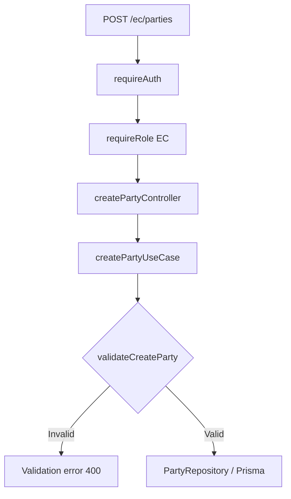

# 2.1 การออกแบบ Unit Testing ระบบ Election

## 1. วัตถุประสงค์และขอบเขต

การทดสอบนี้ครอบคลุมฟีเจอร์ **สร้างพรรคการเมือง (Create Political Party)** รหัส Use Case `UC-EC-01` ผ่านเส้นทาง `POST /ec/parties` โดยใช้ข้อกำหนด `FR-01` ถึง `FR-12` และกฎธุรกิจ `BR-01` ถึง `BR-05` เป็นเกณฑ์กำหนดผลที่คาดหวัง

การทดสอบเดิม `TC-CP-001` ถึง `TC-CP-013` เป็นกรณีทดสอบ API ผ่าน Postman จึงใช้เป็นฐานกำหนดพฤติกรรมเท่านั้น ไม่จัดเป็น Unit Test ที่เขียนใหม่

## 2. โครงสร้างของโปรแกรมที่เกี่ยวข้อง

| หน่วย (Unit) | ไฟล์จริงใน Repository | หน้าที่และขอบเขตทดสอบ |
|---|---|---|
| Input Validator | `src/utils/validateCreateParty.ts` | ตรวจข้อมูลบังคับ ค่าว่าง และการตัดช่องว่าง |
| Create Party Use Case | `src/services/createPartyUseCase.ts` | ตรวจข้อมูลก่อนส่งให้ฟังก์ชันบันทึกที่รับเข้ามาเป็น Dependency |
| Party Service | `src/services/PartyService.ts` | เรียก Use Case และเชื่อมกับ Repository ที่ใช้งานจริง |
| Authentication Middleware | `src/middlewares/AuthMiddleware.ts` | ตรวจ Bearer Token และส่งผู้ใช้ที่ผ่านการยืนยันตัวตนต่อ |
| Role Middleware | `src/middlewares/RoleMiddleware.ts` | ตรวจบทบาท EC และควบคุมการเรียก `next()` |
| Party Repository | `src/repositories/PartyRepository.ts` | จัดรูปแบบข้อมูลที่ส่งให้ Prisma รวมถึง `createdBy`/`updatedBy` |
| Prisma Error Handler | `src/middlewares/PrismaErrorHandler.ts` | แปลงข้อผิดพลาดฐานข้อมูลเป็นสถานะ HTTP ที่เหมาะสม |

## 3. แผนภาพเส้นทางการสร้างพรรคและจุดตรวจสอบ

แผนภาพแสดงเส้นทางของฟีเจอร์ ส่วน Unit Tests แยกฐานข้อมูลด้วย Test Double จึงไม่ใช่ผลทดสอบการเชื่อมต่อ PostgreSQL จริง

## 4. เทคนิคที่ใช้ในการออกแบบ

**Equivalence Partitioning (EP)** แบ่งข้อมูลขาเข้าเป็นกลุ่มที่มีพฤติกรรมเดียวกัน ได้แก่ ข้อความถูกต้อง, ไม่ระบุฟิลด์, `null`, String ว่าง และข้อความที่มีเฉพาะช่องว่าง จึงลดจำนวนกรณีโดยยังตรวจกลุ่มข้อมูลสำคัญได้

**Boundary Value Analysis (BVA)** ตรวจค่าบริเวณขอบของความถูกต้อง เช่น String ว่างเทียบกับข้อมูลที่มีตัวอักษร และช่องว่างที่ถูก `trim()` จนเหลือความยาวศูนย์ ไม่ทดสอบค่าความยาวสูงสุดที่ไม่มีการกำหนดไว้ในข้อกำหนด

**Decision/Branch Testing** ตรวจเส้นทางการตัดสินใจของ Middleware เช่น ไม่มี Token, Token ใช้ไม่ได้, มีสิทธิ์ EC หรือไม่มีสิทธิ์ EC และกรณี Error Handler พบ Prisma P2002

**Interaction Testing** ใช้ Test Double เพื่อยืนยันว่าระบบส่งข้อมูลไปยัง Dependency อย่างถูกต้อง รวมถึงตรวจสอบว่าข้อมูลที่ไม่ถูกต้องไม่ทำให้เรียกฟังก์ชันบันทึก

## 5. การแยก Dependency

ฟังก์ชัน `createPartyUseCase` รับ `writeParty` เป็นพารามิเตอร์ ทำให้ทดสอบ Logic โดยใช้ Stub, Spy และ Mock แทนการเรียกฐานข้อมูลจริง การทดสอบ Middleware จำลอง Request/Response และ `next()` จึงไม่จำเป็นต้องเริ่ม HTTP Server

การตรวจสอบนี้ไม่ใช่ Integration Test ของ PostgreSQL, การอัปโหลด S3 หรือ End-to-End Test ของหน้าเว็บ

## 6. เกณฑ์ยืนยันผล

กรณีทดสอบต้องระบุข้อมูลขาเข้า ผลลัพธ์ที่คาดหวัง และความเชื่อมโยงกับ Requirement โดยผล `PASS` หรือ `FAIL` ต้องมาจากการรันจริงเท่านั้น แยก Test Pass Rate ออกจาก Code Coverage ซึ่งเป็นตัวชี้วัดคนละประเภท

รายละเอียดอยู่ใน [รายการกรณีทดสอบ](./test-cases.md) และ [Requirements Traceability Matrix](./requirement-traceability.md)
