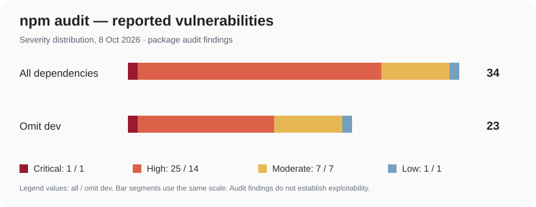

# วิเคราะห์การปรับปรุงโค้ดตามหลัก Verification & Validation

## 1. ปัญหาที่ตรวจพบในเวอร์ชันต้นฉบับ

ฟังก์ชัน `createPartyService` ใน `main` เรียก Repository โดยตรง ไม่มีการตรวจค่าว่างหรือการตัดช่องว่างก่อนบันทึก ซึ่งอาจทำให้ข้อมูลที่ไม่เป็นไปตาม `FR-10`, `FR-11` และ `FR-12` ถูกส่งถึง Persistence Layer นอกจากนี้คำสั่ง `npm test` เดิมไม่ได้เรียก Automated Tests

## 2. การปรับปรุง Input Validation

เพิ่ม `validateCreateParty` เพื่อปฏิเสธฟิลด์ที่ไม่ใช่ String, `null`, String ว่าง และข้อความที่มีเฉพาะช่องว่าง พร้อม Trim ชื่อพรรคและนโยบายก่อนส่งไปบันทึก การปรับปรุงนี้มุ่งยืนยัน Business Rule ที่ระบุว่าฟิลด์ต้องไม่ว่าง และช่วยแยก Logic ให้ทดสอบได้โดยตรง (`UT-CP-001`–`UT-CP-008`)

## 3. การแยก Dependency สำหรับทดสอบ

ปรับ `PartyService` ให้ใช้ `createPartyUseCase` ซึ่งรับฟังก์ชัน `writeParty` เป็น Argument ภายนอก ทำให้การทดสอบไม่ต้องเขียนข้อมูลลง PostgreSQL จริง สามารถใช้ **Stub** ให้คืนค่าที่กำหนด, **Spy** ตรวจจำนวนการเรียก และ **Mock** ตรวจ Argument ที่ส่งไป (`UT-CP-015`–`UT-CP-017`)

ฟังก์ชัน `makeCreateParty` ใน Repository ใช้ตรวจการแมปข้อมูล Audit โดยจำลองการเรียกบันทึก และยืนยันว่า `createdBy` กับ `updatedBy` เท่ากับ User ID ของผู้สร้าง (`UT-CP-012`)

## 4. การตรวจสอบ Middleware และการจัดการข้อผิดพลาด

`makeRequireAuth` เพิ่มความสามารถในการส่ง Lookup Dependency เข้ามาสำหรับ Unit Test โดย Production Export `requireAuth` ยังคงใช้งาน `meService` เช่นเดิม ตรวจเงื่อนไขไม่ส่ง Token, Token ไม่ถูกต้อง, Token ทำให้เกิด Exception และกรณียืนยันตัวตนสำเร็จ (`UT-CP-009`, `010`, `019`, `021`)

Role Middleware ทดสอบผู้ใช้ที่ไม่ใช่ EC และผู้ใช้ที่เป็น EC (`UT-CP-011`, `020`) ส่วน Error Handler ทดสอบการแปลง Prisma P2002 เป็น HTTP 409 และการส่ง HTTP 500 เมื่อเกิดข้อผิดพลาดที่ไม่รู้จัก (`UT-CP-013`, `014`)

## 5. การทดสอบด้วยข้อมูลแบบสุ่ม

ใช้ `@faker-js/faker` สร้างชื่อพรรคที่มี UUID รูป URL และข้อความนโยบายสำหรับ `UT-CP-018` โดยตรวจข้อมูลห้าชุดที่สร้างขึ้นในหนึ่งกรณีทดสอบ เพื่อช่วยลดการพึ่งพาค่าทดสอบคงที่

## 6. ผลการตรวจสอบที่มีหลักฐาน

ชุด Unit Tests 21 กรณีได้รับการตรวจสอบผ่าน GitHub Actions: **ผ่าน 21 กรณี ไม่ผ่าน 0 กรณี** และ Build สำเร็จบน Commit `90bf85727eb6f7745980588729cc002f583cbcda` โดยมีหลักฐานที่ [GitHub Actions Run](https://github.com/Grimstoey/Unit-Testing_Election/actions/runs/37763536100) และ [Test Execution Report](../2.3-unit-test-implementation/test-execution-report.md) ผลนี้ไม่ใช่ Code Coverage หรือการทดสอบเชื่อมต่อฐานข้อมูลจริง

ส่วนที่คงเดิมและส่วนที่แก้ไขสามารถตรวจดูได้ด้วย Git Diff ระหว่าง `main` และ `vnv/election-unit-testing`

## 7. ผลการตรวจสอบ Dependency Security

ดำเนินการตรวจด้วย `npm audit` และ `npm audit --omit=dev` วันที่ 8 ตุลาคม 2026 เพื่อระบุความเสี่ยงของแพ็กเกจที่ติดตั้ง

| ระดับความรุนแรง | ทั้งหมด | ไม่รวม Dev Dependencies |
|---|---:|---:|
| Critical | 1 | 1 |
| High | 25 | 14 |
| Moderate | 7 | 7 |
| Low | 1 | 1 |
| **รวม** | **34** | **23** |

ผล Audit พบช่องโหว่ Critical ใน `proxy-addr` และ High ในกลุ่มแพ็กเกจ เช่น `multer`, `sharp`, `path-to-regexp` และ Dependencies ที่เกี่ยวข้องกับ Prisma จำนวนการแจ้งเตือนนี้เป็นผลตรวจแพ็กเกจ ไม่ใช่หลักฐานว่า API สร้างพรรคมีช่องโหว่ที่นำไปโจมตีได้จริง

การแก้บางรายการด้วย `npm audit fix --force` เสนอให้เปลี่ยน Prisma 7 เป็น 6.19.3 หรือเปลี่ยน Major Version ของแพ็กเกจอื่น ซึ่งมีความเสี่ยงต่อ Compatibility จึงไม่ได้ดำเนินการ Force Update โดยไม่มี Regression Test หลังเปลี่ยน Dependencies
